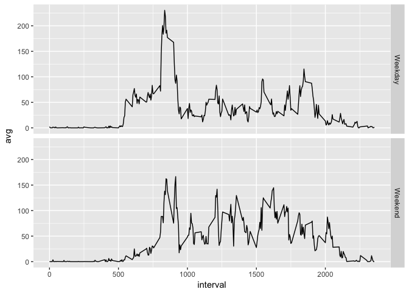

This is the entire assignment for Course Project 1 in a **single R markdown document**.

## Loading and preprocessing the data

Unzip the data and read the .csv file inside. 


```r
data <- read.table(unz("activity.zip", "activity.csv"), header = T, quote  = "\"", sep = ",")
```

## What is mean total number of steps taken per day?

Calculate the total number of steps taken per day using dplyr.

```r
# Remove rows with NA values
data_wo_na = na.omit(data)

# Load dplyr to summarize the steps pr day
library(dplyr)
no_steps_pr_day <- data_wo_na %>%
        group_by(date) %>%
        summarise(steps = sum(steps))
```

Histogram of total number of steps taken each day.

```r
# Load ggplot2
library(ggplot2)

# Plot histogram for steps taken per day
qplot(no_steps_pr_day$steps, geom = "histogram",
      main = "Histogram for steps taken per day",
      binwidth = 1000,
      xlab = "Steps")
```

<!-- -->

Mean and median of total number of steps taken per day.

```r
# Calculate mean and median
mean(no_steps_pr_day$steps)
```

```
## [1] 10766.19
```

```r
median(no_steps_pr_day$steps)
```

```
## [1] 10765
```

## What is the average daily activity pattern?

Plot the average numer of steps taken per interval over all dates using dplyr

```r
# Find average number of steps taken per interval
no_steps_pr_interval <- data_wo_na %>%
        group_by(interval) %>%
        summarise(avg = mean(steps))

# Plot time series for interval
p  = ggplot(no_steps_pr_interval, aes(x = interval, y = avg)) + geom_line()
p
```

<!-- -->

Find interval with the highest number of steps.

```r
# Find the which interval has the highest number of steps
max_steps <- which.max(no_steps_pr_interval$avg)
max_interval <- no_steps_pr_interval[max_steps,1]
max_interval
```

```
## # A tibble: 1 x 1
##   interval
##      <int>
## 1      835
```

## Imputing missing values
Calculate and report the total number of missing values in the dataset (i.e. the total number of rows with NA)

```r
# Summarize rows with NA in steps column
number_na <- data %>%
        summarise(na_count = sum(is.na(steps)))
number_na
```

```
##   na_count
## 1     2304
```

Replace NA-values with mean for corresponding 5-minute interval. Save as a new dataset named *data_na_replaced*.

```r
# Replace NA with avg steps for interval
data_na_replaced <- data %>%
        group_by(interval) %>%
        mutate(steps = ifelse(is.na(steps), mean(steps, na.rm = TRUE), steps))
```

Histogram of the total number of steps taken each day. 

```r
# Load ggplot2
library(ggplot2)

# Calculate steps per day
no_steps_pr_day_na_replaced <- data_na_replaced %>%
        group_by(date) %>%
        summarise(steps = sum(steps))
        

# Plot histogram for steps taken per day
qplot(no_steps_pr_day_na_replaced$steps, geom = "histogram",
      main = "Histogram for steps taken per day",
      binwidth = 1000,
      xlab = "Steps")
```

<!-- -->

Mean and median of total number of steps taken per day.

```r
# Calculate mean and median
mean(no_steps_pr_day_na_replaced$steps)
```

```
## [1] 10766.19
```

```r
median(no_steps_pr_day_na_replaced$steps)
```

```
## [1] 10766.19
```
The mean remains unchanged after the NA-values have been replaced in the dataset. The median has increased and is now equal to the mean.

## Are there differences in activity patterns between weekdays and weekends?
Add column which classifies data as weekday or weekend.

```r
# Find out which weekday each date corresponds to
data_weekday <- weekdays(as.Date(data_na_replaced$date))
data_day <- data_na_replaced
data_day$day <- data_weekday

# Classify each day as either weekday or weekend
data_day <- data_day %>%
        mutate(weekend = case_when(
                day == "Monday" ~ "Weekday",
                day == "Tuesday" ~ "Weekday",
                day == "Wednesday" ~ "Weekday",
                day == "Thursday" ~ "Weekday",
                day == "Friday" ~ "Weekday",
                day == "Saturday" ~ "Weekend",
                day == "Sunday" ~ "Weekend"
        ))
```

Plot average steps taken per interval, averaged across weekday days or weekend days.

```r
# Find average number of steps taken per interval pr weekday/weekend day
steps_weekday <- data_day %>%
        group_by(weekend, interval) %>%
        summarise(avg = mean(steps))

#Plot time series for interval seperated by weekday or weekend day
pp  = ggplot(steps_weekday, aes(x = interval, y = avg)) + geom_line()
pp + facet_grid(weekend ~ .)
```

<!-- -->
